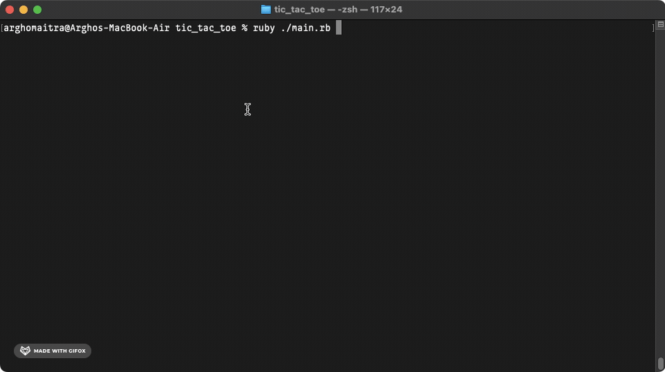

# tic_tac_toe
A Game of Tic-tac-toe on the CLI

## Demo

## General Info

**tic_tac_toe** is the [fifth project](https://www.theodinproject.com/lessons/ruby-tic-tac-toe) in the [Ruby Course](https://www.theodinproject.com/paths/full-stack-ruby-on-rails/courses/ruby) from the [Full Stack Ruby on Rails](https://www.theodinproject.com/paths/full-stack-ruby-on-rails) path in the [The Odin Project](https://www.theodinproject.com/about).

Here, I create a command line version of the popular game, Tic-tac-toe. In this game, two players take turns marking the spaces in a 3-by-3 grid with X or O. The player who succeeds in placing three of their marks in a horizontal, vertical, or diagonal row is the winner.

## Technologies

+ ***CLI***
+ ***Git***
+ ***GitHub***
+ ***Ruby***

## Self-reflections

> This was one of the most tedious projects that I've ever done. I would rank this even harder than the [capstone project](https://www.theodinproject.com/lessons/foundations-calculator) from the [Foundations Course](https://www.theodinproject.com/paths/foundations/courses/foundations) mainly because the involvement of a combination of object-oriented programming, project management, and linting and RuboCop.

> I learned quite a great deal of stuff like the object model, how classes define objects, modules, states and behaviors, instance variables and methods, accessor methods, class variables and methods, constants, to_s method, self, inheritance, mixing in modules, method lookup path, private, protected and public, and finally accidental method overriding.

> I also learned a lot of new things like splitting code into separate files, namespace and scope of required files, development dependencies, gems, bundler, Ruby LSP VSCode extension, linting, formatting, use of RuboCop and its installation and configuration, interaction of RuboCop with Ruby LSP and VSCode, and finally all its major metrics.

## Contact and Support

+ Feel free to contact ***mitrohgr_03505*** on discord for project-related queries.
+ No further feature modifications or improvements will be done to this project.
